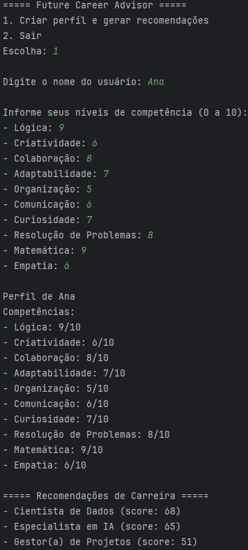

# Future Career Advisor

**Global Solution 2025.2 – Future at Work**

Sistema em Python orientado a objetos que analisa competências de perfis profissionais e gera recomendações de carreiras e trilhas de aprendizado.

---

## Objetivo
Criar uma ferramenta que conecte lógica de programação e automação ao desenvolvimento humano, ajudando estudantes a identificar carreiras e áreas para aprimorar com base em competências técnicas e comportamentais.

---

## Estrutura do projeto
```
future_career_advisor/
│
├── main.py                     # Interface CLI e ponto de entrada
├── models/
│   ├── competencia.py          # Classe Competencia
│   ├── perfil.py               # Classe Perfil
│   └── carreira.py             # Classe Carreira
├── services/
│   └── recomendador.py         # Lógica de recomendação (carreiras.json)
├── data/
│   └── carreiras.json          # Banco de dados de carreiras (JSON)
├── demo/
│   └── demonstracao.png        # Print da execução do programa 
└── README.md
```

---

## Como executar (local)
1. Instale Python 3.8+ (se ainda não tiver).
2. No terminal, navegue até a pasta do projeto:
```bash
cd future_career_advisor
```
3. Execute:
```bash
python main.py
```
4. Siga as instruções na CLI para cadastrar um perfil e gerar recomendações.

---

## Como o sistema funciona (resumo técnico)
- `Competencia`: representa uma competência com nome e nível (0–10).
- `Perfil`: armazena o nome do usuário e um dicionário de competências.
- `Carreira`: contém competências relevantes com pesos; calcula um score multiplicando níveis por pesos.
- `Recomendador`: carrega as carreiras do arquivo `data/carreiras.json`, pontua cada carreira com base no perfil e retorna um ranking.

O armazenamento utiliza dicionários (para competência -> nível), listas são usadas internamente para ranking, e JSON para persistência inicial de carreiras.

---

## Demonstração


---

## Autores
Guilherme Spranger dos Santos – RM: 564059

Gustavo Lemos Diógenes – RM: 565579

Pedro Paulo Barbosa Ross – RM: 563038

